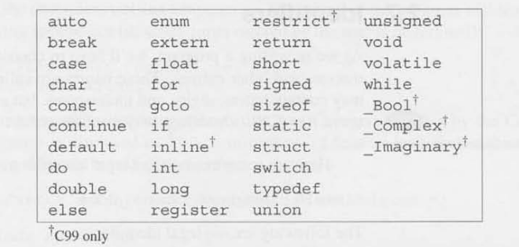
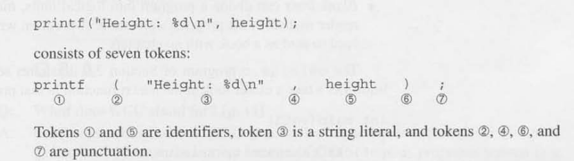

# Chapter 2 - Fundamentals


## Writing a single program 

### Compiling and Linking

We got to convert the program to a form that the machine can execute it usually involves three steps:

- **PreProcessing**: The program is first given to a Preprocessor, that obeys commands that begin with # 
(known as directives). Preprocessor is like an editor; can add things to program and make modification 


- **Compiling**: Modified program goes to a **Compiler**, which translates it into machine instructions 
(**object code**). The program is not quite ready yet.


- **linking**: the final step, a **linker** combines the object code produced by the compiler with 
any additional code needed to complete an executable program. this additional code includes library 
function (like printf) that are used in the program.


``` C
#include <stdio.h>

int main(void) {

	
	printf("To c, or not to C: that is the question.\n");
	return 0;
}
```

- `` #include <stdio.h>`` : Indicates inclusion of the standard I/O l library, a package/collection of 
helpful tools/functions.


- ``printf``: A function that prints formatted text to the terminal window, found within the ``standard I/O`` 
- library.


- ``\n``: An escape character to indicate the cursor to move to a new line within the ``printf`` call.


- ``return 0;``: Indicates that the program "returns" the value 0 to the operating system when it terminates. 


## The General Form of a Simple Program

### Directives

- Commands intended for the preprocessor are called directives.


- always begin with a # character which distinguishes them from other 
items in a C program.


- One line long; no semi colon.


### Functions 
- are like "procedures" or "sub-routines".

- in they are the building blocks from which a program is constructed. A series of statements that have 
been group together and given a name.
  

- A function that computes a value uses the return statement to specify what value it "returns".

    
### ``Main`` 
  - The only mandatory function within a C program, that gets called automatically when the program is 
executed.


- Returns a status code (0 or 1) back to the operating system when the program terminates.


### Statements

- A command to be executed when the program runs

- e.g. ``return`` ``my_function()``


### printing strings

  - String literal: a series or characters enclosed in double quotes.


  - ``\n``: new-line character, terminating output on the current line, and moving to subsequent output to 
the next line.

## Variable and Assignment 

Most programs will need to preform a series of calculation before producing
an output so there needs a way to store data temporarily during program execution. 
In C these storage locations are called variables. 

### Types

Types is a description of what kind of data a variable can hold.

- numeric types: 
Determines the largest and smallest a number can store, as well as 
whether digits are allowed after the decimal point.

    - ``int``: short for integer can store a whole number such as 0, 1,392, or -2553.
  
    - ``float``: short for floating-point can store a much larger number than ``int`` variable.Can also store
    numbers with digits after the decimal point.


### Declarations 

A variable must be declared before they can be used


### Assignment
A variable can be given a value by means of assignment.

- When assigning a ``float`` value, append an f to the end of the number to indicate the type to the 
compiler.
- e.g. ``float x = 3.14f;``

### Printing the value of a variable

We can use ``printf`` to display the current value of a variable.

- Placeholder characters for different variable outputs types:
  - ``%d``: int values
  - ``%f``: float values
    - To display the points after the digit add ``.p`` between ``%`` and ``f`` 
    - e.g ``%.2pf`` - Two digit after the decimal point


### Initialization

When assigning a value it is then called initiation, a variable without assignment is considered 
uninitialized.

- Accessing an uninitialized variable via a ``printf`` reference can lead to a thing called "undefined 
behavior".


- initializer: the value or expression used to assign an initial value to a variable at the time it is 
declared.


- e.g. ``int x = 5;`` -> ``5`` is the initializer 

### Printing Expressions
``printf`` is not limited to displaying numbers stored in variables; it can display value of any numeric 
expression.


- e.g. ``printf("%d\n", height * length * width);``


## Reading input

### ``scanf``
A function to get input from the user via the console and store it in a variable.

- It needs to know the input data it will take (``int``,``float``, etc.).


- e.g. ``scanf("%d" &x);`` will read an integer; store it into variable called x.


- The ``%d`` string/format will tell ``scanf`` to read input that represent an integer called x. 


- The ``&`` symbol (not mention in this chapter) provides the memory address for this new ``int x`` variable
to save value at said memory location.


## Defining Names for constants 

### Macro definitions 
A preprocessor Directive that defines a name or identifier to represent a value or a piece of code. 
When the program compiled, the preprocessor replaces every current of the macro name with its defined value
or code before actual compilation begins


- e.g. ``define PI 3.14159``


- should be uppercase which is a convention many C programmers use.


- a powerful tool allows you to define reusable piece of code, constants and even function-like constructs.


- replaces repetitive complex expressions. 

## Identifiers

Identifiers are chosen names for variable, function macros and other entities.

- May contain letters, digit, and underscores but must begin with a letter or underscore.

- case-sensitive!


- e.g. ``num1``, ``get_num``,``_numberd``, ``numberTwo``

There are keyword reserved in C that have predefined meaning and serves specific purposes in the language 
syntax. they cannot be used as identifiers(such as variables or function names). 
Here is an image shown below of this: 



## Layout of a C Program

Tokens: A group of characters that can't be splut up without changing their meaning.
Identifiers, keywords, operators and function are all tokens.
Here is an image shown below it:




