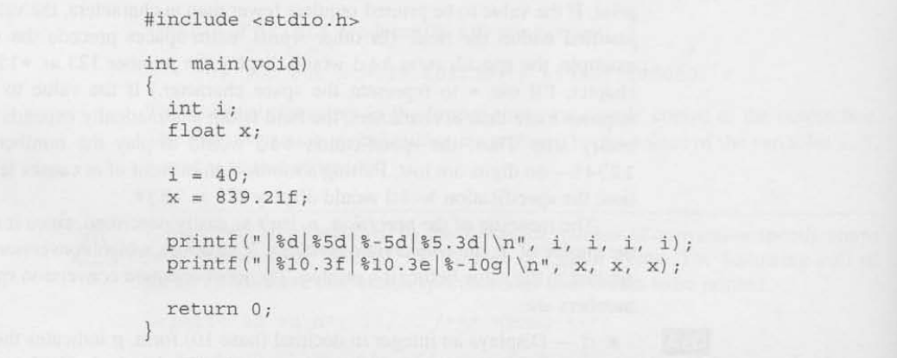
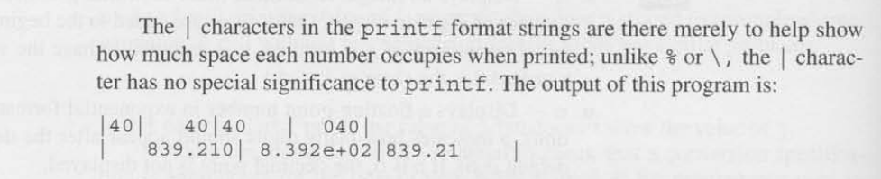
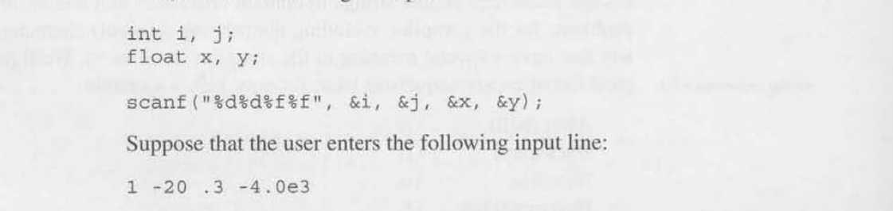
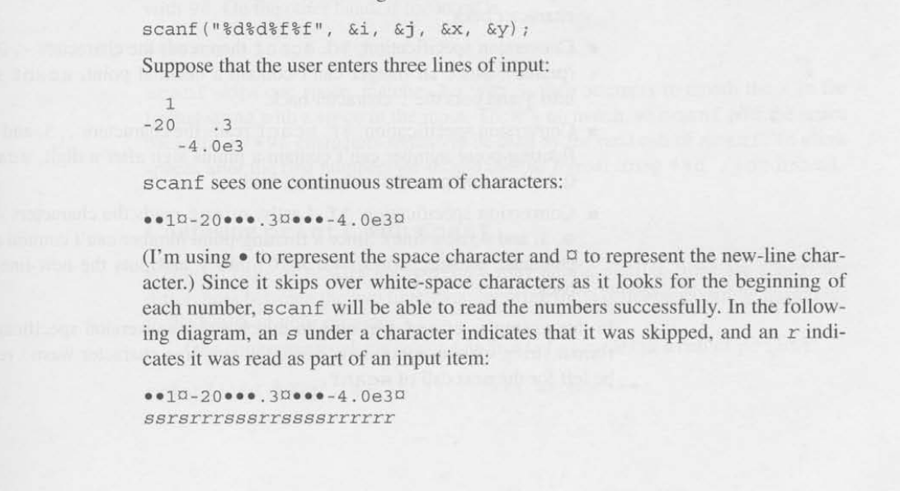

# Formatted Input/Output

## The printf Function 

The printf function is designed to display the content of a string 
known as ***format string*** with values inserted at specified 
in the string.

- e.g. ``printf(string, expr1,expr2,...)``

- Can be constants, variables or more complicated expressions.

## Conversion specification
it's a placeholder representing a value to be filled in during printing.
The information that follows the ``%`` character specifies how the value
is converted from internal (binary) to printed form (characters).

More generally, a conversion specification can have the form:

``%m.pX`` or ``%-m.pX`` where ***m*** and ***p*** are integer constant
and ***X*** is the letter. Both ***m*** and ***p*** are optional.
If ***m*** and ***p*** is omitted, the period that separates ***m*** and ***p***
is also dropped.

- e.g. ``%10.2f`` is **10** is ***m*** **2** if ***p*** and ***X*** is **f**.

### The Minimum field width

The letter ***m*** specifies the minimum number of characters to print
if the value is to be printed requires fewer ***m*** characters, the 
value is right justified within the field. (in other words,extra spaces)
precedes the value.

- e.g. ``%4d`` - Would display the number 123 as ●123

Putting a minus sign in front of m causes left justification.

- e.g. ``%-4d`` - Would display 123 as 123●

### Common Specification

- ``%d`` - displays an integer in decimal (base 10) form. 

- ``%e`` - Displays a floating point number in exponential format.

-``%f`` - Displays a floating point number in "fixed decimal" format
           without an exponent.

- ``%g`` - Displays a floating point number in either exponential format 
           or fixed decimal format, depending on the number's size.
           unlike f conversion, the g conversion won't show trailing
           zeros.

Here are some example of using Conversion specifiers in the C:

## Escape Sequences

The ``\n`` code that we often use in format string is called an ***escape
sequence***. They enable strings to contain characters that would otherise 
cause problems for the compiler such as nonprinting (control). 

Here is a list sample of some escape sequences: 

- ``/a`` - alert (bell)

- ``/b`` - backspace

- ``/n`` - new line

- ``/t`` - horizontal tab

- `\\` - prints one "/" character.

## The ``scanf`` Function

``scanf`` reads input according to a particular format. A``scanf`` format string 
like how a  ``printf`` will format a string but only contain conversion specification

Here is an example:

### How ``scanf`` Works

- For each conversion specification in the format string, ``scanf`` tries to locate an 
  item of the appropriate type in the input data, skipping blank spaces if necessary.

- If item is read successfully, ``scanf`` continues processing the rest of the format string

- If any item is not read successfully ``scanf`` returns immediately without looking at the rest
  of the format string (or the remaining input data)

- Returns an **integer** representing the number of successful reads and 0 or -1 for failure

- Ignores **white-spaces characters (the space,horizontal and vertical tab,form-feed and new
  new-line characters)

### Rules of ``scanf``

- Integer: searches for a digit, a plus sign or a minus sign; then reads digit until it reaches
  a non-digit.

- Float: searches for a plus sign or minus sign(optional), followed by a series of digit (possibly
  containing a decimal point) followed by an exponent (optional).
  - An exponent consist of the letter ``e`` (or ``e``), an optional sign, and one or more digits.

