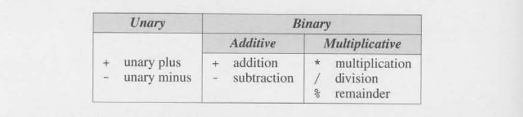
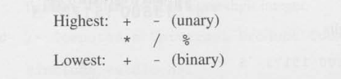
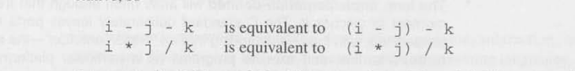
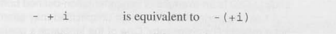
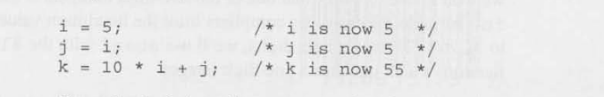
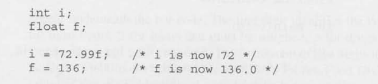
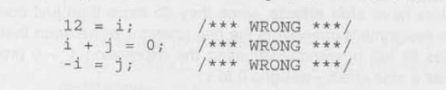
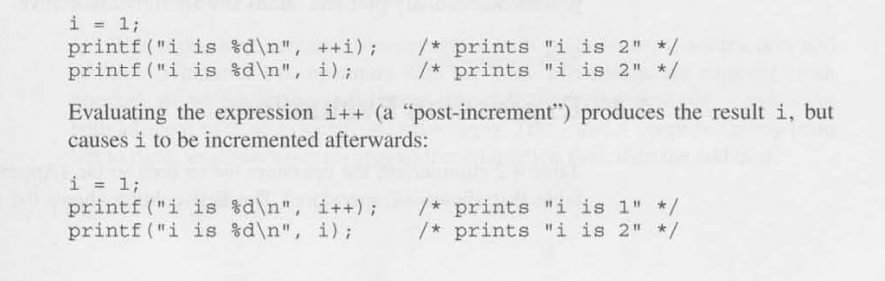
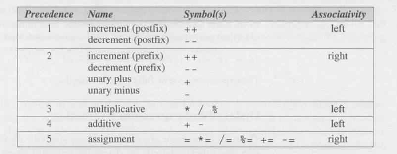

# Chapter Four Expressions

Expressions are formulas that show how to compute a value. 

- A Variable represents a value to be computed as the programs runs


- A Constants represents a value that does not change


- A Operator is a symbol that preforms specifics operations on values or variables
  (e.g. +, -, *, / )


- A Operand is the values or expressions on which the operator acts.


## Arithmetic Operators

Arithmetic operators are operators that preform addition, subtraction,multiplication and division
these are the workhorses of many programming languages including C.

- Unary: Operators that require **one** operand.


Here is the table that shows arithmetic operators



### Binary

Operators that require **Two** operands.

#### Additive:
- Addition ``+``: Adds two values together
- Subtraction ``-``: Subtracts two values together


#### Multiplicative:
- Multiplication ``*``: Multiplies two values together


- Division ``/``: 
  - ``int / int``returns the floored value of the quotient
  - `float / int` returns a ``float``
  

- Remainder (modulo) ``%``: ``i % j`` returns the remainder of the quotient ``i / j``
  - Both operands require to be ``int`` type.

### Unary

Unary: Operators that require **one** operand.

- Unary plus ``+`` will increase and be positive
- Unary minus ``-`` will decrease and be negative

## Implementation-Defined Behaviour

The C standard allow certain aspects of the language to vary between different compilers, architectures, or operating system
but requires that the implementation document how it behaves.
it is best to avoid writing program that depend on implementation-defined behaviour.


## Operator Precedence and Associativity 

It is a rule that determines the order in which operators in an expressions are evaluated.
In C it uses  ***operator*** precedence rules to solve this potential ambiguity.

The arithmetic operators have the following relative precedence:



Operators listed on the same line have equal precedence. Operator precedence 
rules alone aren't enough when an expressions contain two or more operators at the same level of precedence. In this situation
The ***associativity*** of the operators comes into play

- An operator is said to be ***left associative*** if it groups from left to right.
- The binary arithmetic operators are all left associative.



- An operator is ***right associative*** id it groups from right to left.
- The unary arithmetic operators are both right associative.



## Assigment Operators 

### Simple Assignment

The effect of the assignment ``v = e`` is to evaluate the expression ***e***
and copy its value into ***v***. The example below show ***e*** can be a constant,
a variable or more complicated expression:



If ***v*** and ***e*** don't have the same type then the value of ***e*** is converted
to the type of ***v*** as the assignment takes place.



In many programming languages assignment is a statement, In C however assignment is an operator, just like 
``+``. In other words, the act of assignment produces a result just as adding two  numbers produces a result.

### Side Effects! 

Simple Assignment (=) has a side effects, it modifies its left operand meaning evaluating the expression
``i = 0`` produces the result ``0`` and, as a side effect assigns ``0`` to ``i``.

## L Values

A ***lvalue*** represents an object stored in computer memory, not a constant or a result of a computation.
The Variable are ***lvalue***; expressions such as ``10`` or ``2 * i`` are not.

Since the assignment operator requires a ***lvalue*** as its left operands, it is illegal to pyt any other kind of 
expression on the left side of an assignment expression



## Compound Assignment

C ***Compound assignment*** operators allow us to shorten this statement and other like it using the ``+=`` operator by 
simply writing:


Here are most of the compound assignment operators:

- ``v += e`` - Adds ***v*** to ***e***, storing the result in ***v***

- ``v -= e`` - Subtracts ***e*** from ***v***, storing the result in ***v***

- ``v *= e`` - Multiplies ***v*** by ***e***, storing the result in ***v***

- ``v /= e`` - Divides ***v*** by ***e***, storing the result in ***v***

- ``v %= e`` - ***e*** computes the remainder when ***v*** is divided by ***e***, storing the result in ***v***


## Increment and Decrement Operators

Two of the most common operation on a variable are "Incrementing" (adding 1) or "decrementing" (subtracting 1).
We can do this by basic task by writing:

````
i = i + 1;
j = j -1;
````

The compound assignment operators allow us to condense these statement a bit:
````
i += 1;
j = -= 1;
````

C however allows us to shorten this even further by using the ``++`` and the 
``-`` operators.

At first glance they are simple as ``++`` adds 1 and ``-`` subtracts 1.
This is misleading however as they can be used as a ***prefix*** operators or a 
***postfix*** operators.
```
++i //  prefix
i++ // postfix

--i  // prefix
i-- // postfix
```

Another complication is that the assignment operator modify the expression depending on if its ***prefix*** or ***postfix***
operators. Here it is shown:




## Expression Evaluation

Here is an image of the precedence of each operator relative to the other operators in the table (highest precedence is 1; Lowest is 5)
The last column shows the **associativity** of each operator.




```
// Example of breaking up and seeing the precedence 

a = b+= c++ - d + --e / -f;

// highest precedence 
a = b += (c++) - d --e / -f

// precendence 2
a = b += (c++) - d (--e) / (-f)

// precendence 3
a = b += (c++) - d ((--e) / (-f))

// precendence 4
a = b += (((c++) - d) ((--e) / (-f))))

// precendence 5
(a = (b += (((c++) - d ((--e) / (-f)))))

// The expression is fully parenthesized 
```

