# Chapter 5 Selection Statements


C has relatively few statement, two we have seen are 
``return`` statement and the ***expression*** statements.
Most of C remaining statement fall into three categories.
This chapter will cover selection statements and the compound statements.

- ***Selection statements*** - The ``if`` and ``switch`` statements allow a program to select a particular execution path from a set of alternatives


- ***Iteration statement*** - The ``while`` ``do`` and ``for`` statement support iteration (looping)


- ***Jump statements*** - The ``break`` ``continue`` and ``goto`` statement cause an unconditional jump to some other place in the program.
  (the ``return`` statement belongs in this category as well).


## Logical Expressions 

Logical expressions must test the value of an expression to see it is "true" or "false".
Such as an example is an ``if`` statement might need to test 
the expression ``i < j`` to either ``0`` (false) or ``1`` (true).


### Relational Operators 

Relational operators corresponds to the ``<``, ``>``, and ``≤``, ``≥`` operators of mathematics in which
they produce ``0`` (false) or ``1`` (true).

- e.g. ``10 < 11`` is ``1``; The value of ``11 < 10`` is ``0``

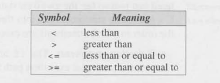


### Equality Operators

The ***equality operator*** have a unique appearance. The 
"equal to" operator is two adjacent ``=`` characters, not one
as a single ``=`` characters represents assignment operator.
The "not equal to" operator is also two characters: ``!`` and ``=``.

- The equality operators are left associative 


- they produce either ``0`` (false) or ``1`` (true)


- The equality operators have lower precedence than relational operator
  - e.g. ``i < j == j < k`` is equivalent to ``(i < j) == (j < k)``

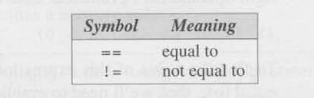


### Logical Operators

Logical expressions can be built from simples ones by using the logical operators:
- ***and***
- ***or***
- ***not***

The ``!`` operator is unary, while ``&&`` and ``||`` are binary.
The logical operators also produce either a ``0`` or ``1``and often the operand will have
values of ``0`` or ``1`` but it's not a requirement. The logical operator treat any non-zero 
operand as a true value and any zero operand as a false value.

- ***!expr*** has the value of ``1`` if ***expr*** has the value of ``0``


- ***expr1*** ``&&`` ***expr2*** has the value of ``1`` if the value of **expr1*** and ***expr2***
  are both non-zero.


- ***expr1*** ``||`` ***expr2*** has the value of ``1`` if the value of **expr1*** or ***expr2***
  has a non-zero value.

In other cases, these operators will produce the value ``0``.

- The ``!`` operators has the same precedence as the unary plus and minus operators


- The ``&&`` and ``||`` is lower than that of the relational and equality operators.
  - e.g. ``i < j && k == k`` means ``(i < j ) && (k == m)``


- The ``!`` operator is right associative; ``&&`` and ``||`` are left associative.


## The ``if`` Statement

The ``if`` will allow a program to choose between two alterative by testing the value
of an expression. The ``if`` statement has the form of:

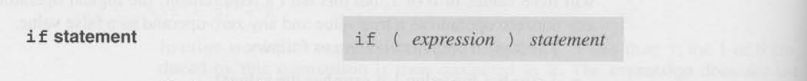

- The parenthesis around the expressions are mandatory as they are a part of the ``if`` statement not the 
  expression


When a ``if`` statement is executed, the expressions in the parenthesis is evaluated. 
If the value of the expression is nonzero - which C interprets as true - the statement is executed

e.g.

``` 
if (line_ num == MAX_LINES)
  line_num = 0;
```

The statement ``line_num = 0;`` is executed if the condition ``line_num == MAX_LINES`` is true (a non-zero value)


## Compound Statement

A compound statement is if we want to control two or more statements.


By putting braces around a group of statement we can force the compiler to treat it as a single statement.
Here is an example below:
- e.g. ``{ line_num = 0; page_num++; }``

For clarity, I'll show you in several line the one statement:
```
{
line_num - 0;
page_num++;
}
```

Each inner statement still ends with a semicolon, but the compound statement itself does not 
Here is what a compound statement will look like when used inside an ``if`` statement:

```
if (line_ num == MAX_LINES) {
  
  line_num - 0;
  page_num++;

}
```

Compound statement are also common in loops and other places where the syntax of C requires a single statement but when we want more than one.


### The ``else`` Clause

An ``if`` statement can have an ``else`` clause if the expressions in the parenthesis has the value of ``0``.

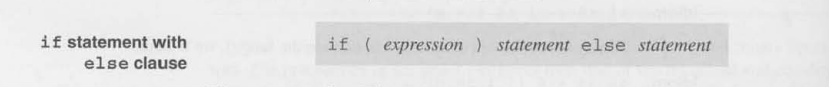

Here is an example of this below:

```
if ( i > j) {
  max = i;

else
  max = j;  
  
}
```

An ``if`` statement can be nested inside other ``if`` statements. Consider this example which finds the largest of the number
stored in ``i``, ``j`` and ``k`` and stores the value in ``max``:

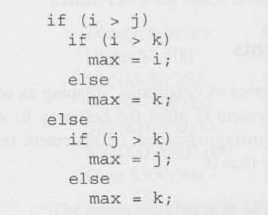

Also, the ``if`` statement can be nested to any depth.Aligning each ``else`` with matching ``if``
can make it easy to read for the user. Also don't hesitate to add braces shown below:

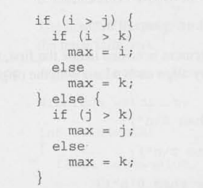

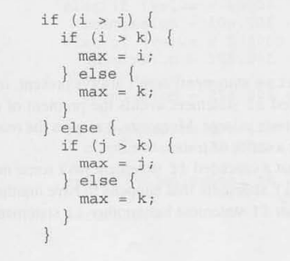

### Cascaded ``if`` Statements

Sometimes we need to test a series of condition. A "Cascaded" ``if`` statement is often the best way
to write such a series of test. 

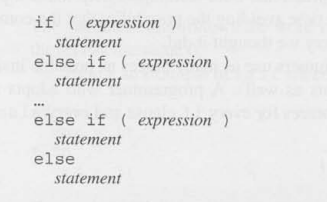

for example to test whether ``n`` is less than ``0``, equal to ``0``
or greater than ``0``:

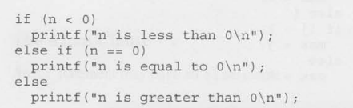

### Dangling ``else`` problem 

Watch out for the notorious "dangling else" problem. As when you have nested ``if`` statement 
without braces ``({})`` an ``else`` is automatically paired with the nearest unmatched ``if`` statement that 
has not been already paired with an ``else``.

here is an example of this and shows you what actually happens after:

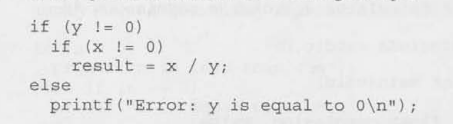

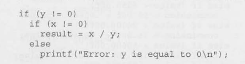

To fix this is to add braces shown below:

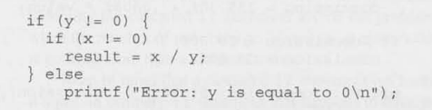

### Conditional Expressions

C statements allows you to preform one of two action depending on the value of the condition
C provides an operator that allows an expression to produce one of two values depending on the value of a condition.

The ***Conditional operator*** constitute of two symbols ``?`` and ``:`` which must be put together like this:

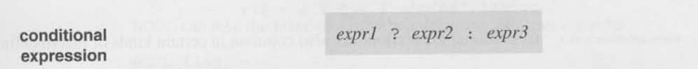

- The ***expr1*** ***expr2***  ***expr3*** can be of any type


- the resulting expression is said to be a ***Conditional expression***


- it requires three operands instead of one or two for this reason it is often referred as ***ternary*** operator

The expressions ***expr1*** ``?`` ***expr2*** ``:`` ***expr3*** can be read as
" if ***expr1*** then ***expr2*** else ***expr3*** "

the expression is evaluated in stages:

- ***expr1*** is evaluated first; if it isn't zero then:


- ***expr2*** is evaluated and its value is the value of the entire conditional expression 


- if the value of ***expr1*** is zero then the value of ***expr3*** is the value of the conditional 

Here is an example of this:

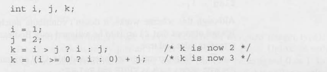

## Boolean Values in C89

Many years The C language lacked a proper Boolean type and the workaround was to decode an ``int``
variable then assign it either ``0`` or ``1``:

```
int flag;

flag = 0;
...
flag = 1;

```

This worked but the readability was not obvious as we didn't know ``flag``
was to be assigned a Boolean values and that ``0`` and ``1`` represents false or true

So instead programmers often used macros with names such as ``TRUE`` and ``FALSE``

```
#define TRUE 1 
#define FALSE 0
```

Assignment to `flag` is now natural:

```
flag = FALSE;
...
flag = TRUE;
```

You could define macros with a type and the macro name ``BOOL`` can take place
of ``int`` when declaring a Boolean variable:

```
#define BOOL int

...
BOOL flag;
```


### Boolean Values in C99

In this version a Boolean variable can be declared by writing 
``_Bool flag;`` which ``_Bool`` is an integer type (more precisely, an unsigned integer type)
so a ``_Bool`` variable is really just an integer variable in disguise.

- ``_Bool`` can only be assigned ``0`` or ``1``


- assigning a ``_Bool`` variable causes the variable to be assigned a ``1``
  - e.g. ``flag = 5; /* flag is assigned 1 */``


- C99 will provide a new header called ``<stdbool.h>`` to make it easier to work with Boolean values.
  - provides a macro, `bool` that stands for ``_Bool``.
  - e.g. ``bool flag ; /* same as _Bool flag */``
  - Also provides macro named ``true`` and ``false``
  - e.g. ``flag = true; flag = false'``


## Switch Statement

A ``switch`` statement is an alternative to a cascaded ``if`` statement.
C provide the ``switch`` statement. 

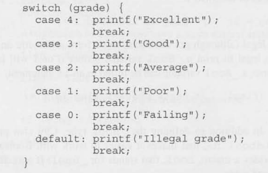

- The variable ``grade`` is tested against case 4, 3, 2, 1 and 0 and
  if it matches a values the statement is followed by the ``:`` within the case statements are preformed

Here is the overall expressions shown:

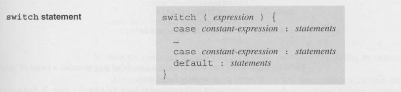

#### ***Controlling expression*** 

- the word ``switch`` must be followed by an integer expression in parentheses


- Characters are treated as integers in C and can be tested in ``switch statments``

- Floating point numbers and string do not qualify

#### ***Case Labels***

- Each case begins with a label form
  - ``case constant-expression :``


#### ***Constant expression***

- Much like an ordinary expression except that it cant contain variables or function calls


- thus ``5`` is a constant expression and ``5 + 10`` is a constant expression (characters are also acceptable)


- ``n + 10`` is not a constant expressions. The constant expression in a case label must valuate to an integer


#### ***statement***

- After each case label comes any number of statements


- No braces are required around the statement 


- The last statement in each group is normally break


### The Role of the ``break`` Statement

The role of the ``break`` statement is quote on quote "break" out of the ``switch``
statement; execution continues after the ``switch`` if no ``break`` statement is added.

The reason is that we need ``break`` has to do with the fact that is really form of a "computed jump". 
When controlling expressions is evaluated, control jump to the case label matching the value of the ``switch``
expression. A case label is nothing more than a marker indicating a position within the ``switch``. when the last statement 
in the case has been executed, control "falls through" to the first statement in the following case; the case label for the next case is 
ignored. Without ``break`` (or some other jump statement), control will flow from one case into the next. 


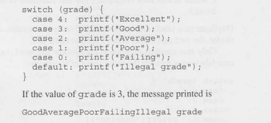


