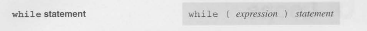
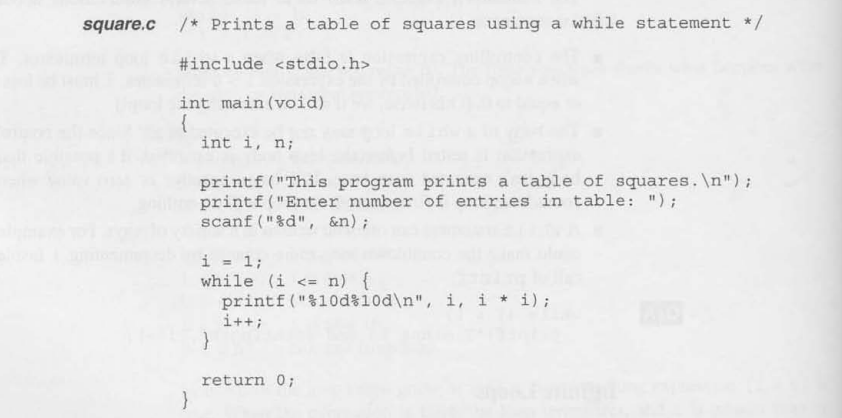
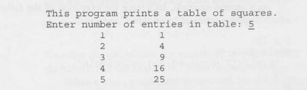
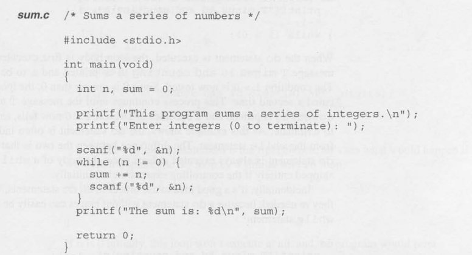
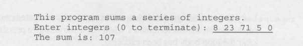
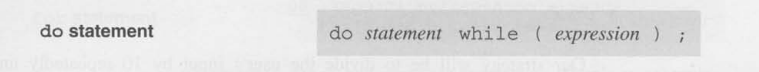
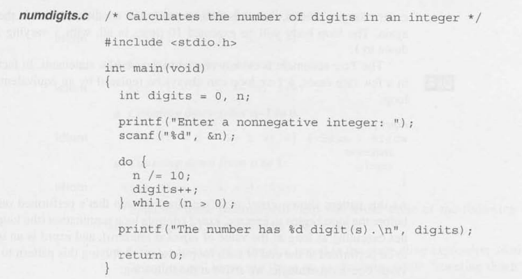
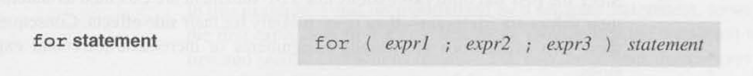
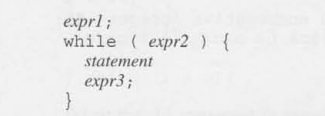
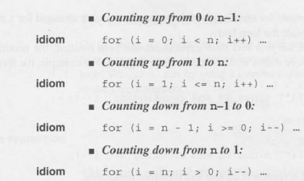

# Loops

A loop is a statement whose job is repeatedly execute some other statement the 
(**loop body**).

Every loop has a ***controlling expression*** that is each time a loop body is executed meaning
(an ***iteration*** of the loop), the controlling expression is evaluated.
If the expression is true - a value that is not zero - the loop continues to execute.

C provides three iteration statments:

### ``while``:
The ``while`` statement is used for loops whose controlling expression 
is tested before the loop body is executed.

### ``do``:
The ``do`` statement is used if the expression is tested after the loop
body is executed.

### ``for``:
The ``for`` statement is convenient for loops that increment or decrement a counting
variable.

There is also C features that are used in conjuction with loops which are:

### ``break``:
The ``break`` jumps out of a loop and transfer control to the next statement

### ``continue``:
The ``continue`` will skip the rest of a loop iteration.

### ``goto``
The ``goto`` will jump to any statement within a function. 


## The ``while`` Statement

The ``while`` statement is the simplest and most fundamental form:



```
int i = 0;
int n = 10;

while (i < n) {     /* controlling expression */
i = i * 2;          /* loop body */
 }
```

A ``while`` statement can often be written in a variety of ways. For example we 
could make a countdown loop more concise by decrementating ``i`` inside the call 
``printf``:

```
int i = 10;

while (i > 0) {
printf("T minus %d and counting\n", i--);
}
```

### Infinite Loops

A ``while`` statement won't terminate if the controlling expression is always
has a nonzero value. Sometimes C programmer deliberatley create an **infinite
loop** by using a nonzero constant as the controlling expression:

``while (1) ...``

This ``while`` statement will execute forvever unless its body contains a statement that 
transfer control out of the loop (``break``, ``goto``,``return``)

Here is two example of a ``while`` statement that you can make:

#### First example:


### First example output:


#### Second example:


### Second example output:


Notice that the condition in the second example has ``n != 0`` is tested 
just after the number is read, allowing the loop to terminate 
as soon as possible.


## The ``do`` Statement

The ``do`` statement is essentially just a ``while`` statment whose 
controlling expression is tested after each execution of the loop body.
The ``do`` statement form is shown below:



WWhen the ``do`` statement is executed, the loop body is executed first,
then the controlling expression is evaluated.

let's rewrite the countdown example using a ``do`` statement:

```
int i = 10

do {
    printf("T minus %d and counting\n", i)
    --i;
} while (i > 0);
```

Here is an example of a ``do`` statement:




## The ``for`` Statement

The ``for`` statement is ideal for loops that have a "counting"
variable, but can be versatile to be used for other kinds of loops too.

The ``for`` statement form is:




A ``for`` loop is closely related to the ``while`` statement.
A ``for`` loop can always be replaced by an equivalent ``while``
loop except in a few rare cases.



- *expr1* is the initialization of a variable (normally an ``int`` to increment/decrement)
- *expr2* is the controlling expression gating entrance to the loop body.
- *expr3* is the update to the *expr1* variable to change the outcome of the evalaution
  of the controlling expression on the next iteration


```
int i = 10;

while (i > 0) {
printf("T minus %d and counting\n", i--);
}
```
### Or

```
for(i = 10; i < 0; i--) {
    printf("T minus %d and counting\n", i );
}
```

### ``for`` Statements Idioms
A ``for`` statements that counts up or down a total of ``n`` times will usually have one of the following
forms:



Imitating these pattern can help you avoid some of the following errors which alot of beginning C programmer 
(like me) can often make:

- using ``<`` instead of ``>`` or vice versa
- using ``==`` instead of the ``>``, ``>=``, ``<``, ``>=``
- "Off-by-one" errors such as writing the controlling expression as ``i <= n``
  instead of ``i < n``

### Omitting Expression in a `for` Statement

The ``for`` statement is even more flexible than we have seen so far.
Some ``for`` loops may not need all three expression that normally a control a loop.
So C can allow us to use a shortcut to omit any or all of the expression.


