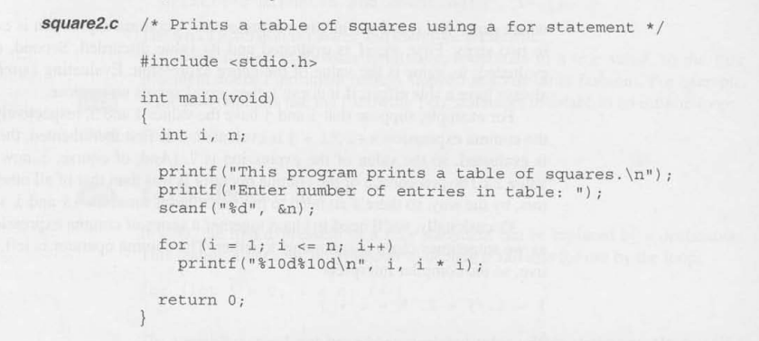
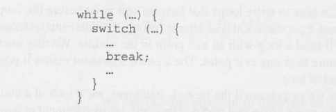
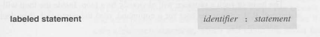
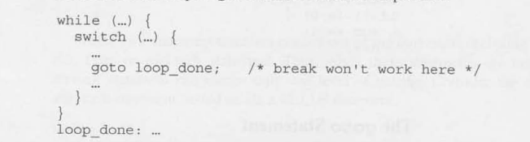
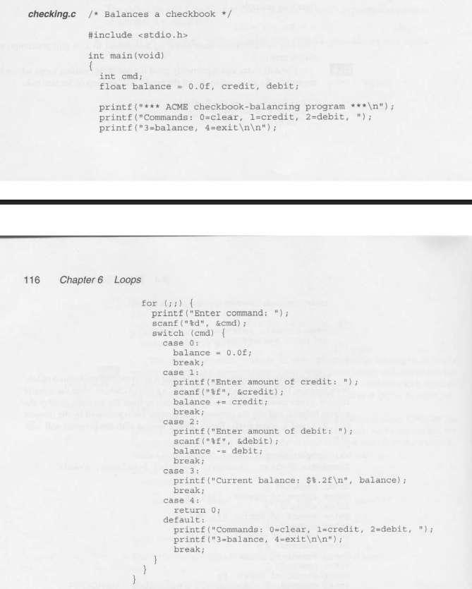

# Loops

A loop is a statement whose job is repeatedly execute some other statement the 
(**loop body**).

In C Every loop has a ***controlling expression***. Each time a loop body is executed meaning
an ***iteration*** of the loop, the controlling expression is evaluated.
If the expression is true - a value that is not zero - the loop continues to execute.

C provides three iteration statements:

### ``while``:
The ``while`` statement is used for loops whose controlling expression 
is tested before the loop body is executed.

### ``do``:
The ``do`` statement is used if the expression is tested after the loop
body is executed.

### ``for``:
The ``for`` statement is convenient for loops that increment or decrement a counting
variable.

There is also C features that are used in conjunction with loops which are:

### ``break``:
The ``break`` jumps out of a loop and transfer control to the next statement

### ``continue``:
The ``continue`` will skip the rest of a loop iteration.

### ``goto``
The ``goto`` will jump to any statement within a function. 


## The ``while`` Statement

The ``while`` statement is the simplest and most fundamental form:


```
int i = 0;
int n = 10;

while (i < n) {     /* controlling expression */
i = i * 2;          /* loop body */
 }
```

A ``while`` statement can often be written in a variety of ways. For example, we 
could make a countdown loop more concise by decrementing ``i`` inside the call 
``printf``:

```
int i = 10;

while (i > 0) {
printf("T minus %d and counting\n", i--);
}
```

### Infinite Loops

A ``while`` statement won't terminate if the controlling expression is always
has a nonzero value. Sometimes C programmer deliberately create an **infinite
loop** by using a nonzero constant as the controlling expression: ``while (1) ...``

This ``while`` statement will execute forever unless its body contains a statement that 
transfer control out of the loop (``break``, ``goto``,``return``)

Here is two example of a ``while`` statement that you can make:

#### First example:


### First example output:


#### Second example:


### Second example output:


Notice that the condition in the second example has ``n != 0`` is tested 
just after the number is read, allowing the loop to terminate 
as soon as possible.


## The ``do`` Statement

The ``do`` statement is essentially just a ``while`` statement whose 
controlling expression is tested after each execution of the loop body.
The ``do`` statement form is shown below:


When the ``do`` statement is executed, the loop body is executed first,
then the controlling expression is evaluated.

let's rewrite the countdown example using a ``do`` statement:

```
int i = 10

do {
    printf("T minus %d and counting\n", i)
    --i;
} while (i > 0);
```

Here is an example of a ``do`` statement:


## The ``for`` Statement

The ``for`` statement is ideal for loops that have a "counting"
variable, but can be versatile to be used for other kinds of loops too.

The ``for`` statement form is:


A ``for`` loop is closely related to the ``while`` statement.
A ``for`` loop can always be replaced by an equivalent ``while``
loop except in a few rare cases.


- *expr1* is the initialization of a variable (normally an ``int`` to increment/decrement)
- *expr2* is the controlling expression gating entrance to the loop body.
- *expr3* is the update to the *expr1* variable to change the outcome of the evaluation
  of the controlling expression on the next iteration


```
int i = 10;

  while (i > 0) {
    printf("T minus %d and counting\n", i--);
  }
```
### Or

```
for(i = 10; i < 0; i--) {
  printf("T minus %d and counting\n", i );
}
```

### ``for`` Statements Idioms
A ``for`` statements that counts up or down a total of ``n`` times will usually have one 
of the following forms:


Imitating these pattern can help you avoid some of the following errors which alot of beginning 
C programmer (like me) can often make:

- using ``<`` instead of ``>`` or vice versa
- using ``==`` instead of the ``>``, ``>=``, ``<``, ``>=``
- "Off-by-one" errors such as writing the controlling expression as ``i <= n``
  instead of ``i < n``

### Omitting Expression in a `for` Statement

The ``for`` statement is even more flexible than we have seen so far.
Some ``for`` loops may not need all three expression that normally a control a loop.
So C can allow us to use a shortcut to omit any or all of the expression.

If the first expression is omitted, no initialization is performed before the loop is executed:

```
int i = 10;

  for (; i > 0; --i) {
    printf("T minus %d and counting\n", i);
  }
```
In this example ``i`` has been initialized by a separate assignment so we have omitted 
the first expression in the ``for`` statement.

If we omit the third expression in a ``for`` statement, the loop body will be responsible for 
the value of the second expression to eventually become false shown below:
```
int i;

  for (i = 10; i > 0;) {
    printf("T minus %d and counting\n", i--);
  }
```
When the *first* and *third* expression are both omitted, the resulting loop is nothing 
more than a while loop  an example is this:

```

// for loop with omitting the first and the third expression
int i = 10;

  for (; i > 0; --i) {
    printf("T minus %d and counting\n", i);
  }

// is the same as 

  while (i > 0) {
    printf("T minus %d and counting\n", i--);
  }
```
Therefore, a ``while`` loop is more peferable

Some programmers use the following ``for`` statement to establish an infinite loop:
```
for(;;) {
  ...
}
```

### ``for`` Statements in C99

In C99, the first expression in a ``for`` statement can be replaced by a declaration
This features allows you to declare a variable for use by the loop:

```
for (int i = 0; i < n; i++) {
  ...
}
```
The variable ``i`` has not been declared prior to the statement. However, if a variable of 
the same name exist the statement creates a ``new`` version of ``i`` that will only be used 
within the loop. A variable declared by a ``for`` loop can not be accessed outside the body 
of the loop.

A ``for`` loop statement may declare more than one variable, provide that all the variable 
are of the same type:
```
for (int i = 0, j = 0; i < n; i++) {
  ...
}
```

### The Comma Operator

The comma operator is used when we might like to write a ``for`` statement with two (or more)
initialization expression or one that increments several variables each time through the loop.


Let revisit the square example and convert it into a ``for`` loop instead.




## Exiting from a Loop

The ``break`` statement makes it possible to exit out of the loop body in the middle of a loop 
statement. 

An example of this is we want check whether a number``n`` is prime. Our plan is 
to write a ``for`` statement that divides ``n`` by the number between ``2`` and ``n-1``
We should break out if any divisor is found. After breaking out we can use an ``if`` statement 
to determine whether termination was premature (hence ``n`` isn't prime) or normal (``n`` is prime)

```
int d;
int n = 10; // user inputs a number (hardcoded for this example)

 for (d = 2; d < n; d++) {
  if (n % d == 0) {
   break;
  }

  }
    
  if ( d < n) {
    printf("%d is divible by %d\n", n,d);

  } else {
    printf("%d is prime \n", n,d);
  }
```
The ``break`` statement is useful for writing loops to which to exit in the middle of the
body rather the end here shown below:

```
int n;
        
 for (;;) {
  printf("Enter a number (0 to stop): ");
  scanf("%d", &n);
  if (n == 0) {
    break;
  }
  printf("%d cubed is %d", n, n * n * n);
```
  
A ``break`` statement transfer control out of the innermost enclosing ``while``
``do`` or ``for`` statement. When these statement are nested the ``break`` statement only 
escapes one level of nesting. If using on a ``switch`` statement it will transfer control out 
of the ``switch`` statement but not out of the ``while`` loop.




### The ``continue`` statement

The ``continue`` statement transfers control to a point just before the end of the loop body.
Control remains within the loop.The following example read a series of number and whenever a 
``0`` is read the ``continue`` statement is executed:

```
int n = 0;
int sum = 0;

 while (n < 10) {
    scanf("%d", &i);
    if (i == 0) {
      continue;
      sum += i;
    }
    n++;
 } 
```

### The ``goto`` statement

The ``goto`` statement is capable of jumping to any statement in a function, provided that the 
statement has a **label** is just an identifier placed at the beginning of a statement:



A statement that may contain more than one label. The ``goto`` statement itself has the form


Here is an example where if C did not have a ``break`` statement, here how we might use a 
``goto`` statement to exit prematurely from a loop:

```
int d;
int n = 10; // user inputs a number (hardcoded for this example)

 for (d = 2; d < n; d++) {
  if (n % d == 0) {
   goto done;
  }

  }
    
  goto done: {
    printf("%d is divible by %d\n", n,d);

  } else {
    printf("%d is prime \n", n,d);
  }
```
The ``goto`` statement is helpful once in a while as it's rarely needed in everyday C programming.
Consider the problem of exiting out of a loop within a ``switch`` statement. we saw earlier, the 
``break`` statement does not quite have the right effect so a ``goto`` solves that issue:



Here is an example of using infinite ``for`` loop and adding a ``switch`` statement within it.



## The Null Statement 

A statement can be ***null*** meaning devoid of symbols except for the semicolon 
at the end.
an example is this - ``i = 0; ; j = 1;``

This example contains three statements:
- An assignment to i
- a null statement
- an assignment to j

The null statement a good for one thing: Writing loops whose bodies
are empty. an example of this is the prime-finding loop.
If we move the ``if`` statement into the loop controlling expression,
the body of the loop becomes empty:

```
// prime finding loop

for (d = 2; d < n; d++) {
  if (n % d == 0) {
    break;
  }
}
// null statement 

for (d = 2; d < n; && n % d !=0; d++)
/* empty loop body */; 

```

Converting an ordinary loop into one with an empty body does not buy much 
however the new loop is often more concise but usually no more efficient.
In a few cases though a loop with an empty body is clearly superior such as
these loops are helpful for reading character data. 


